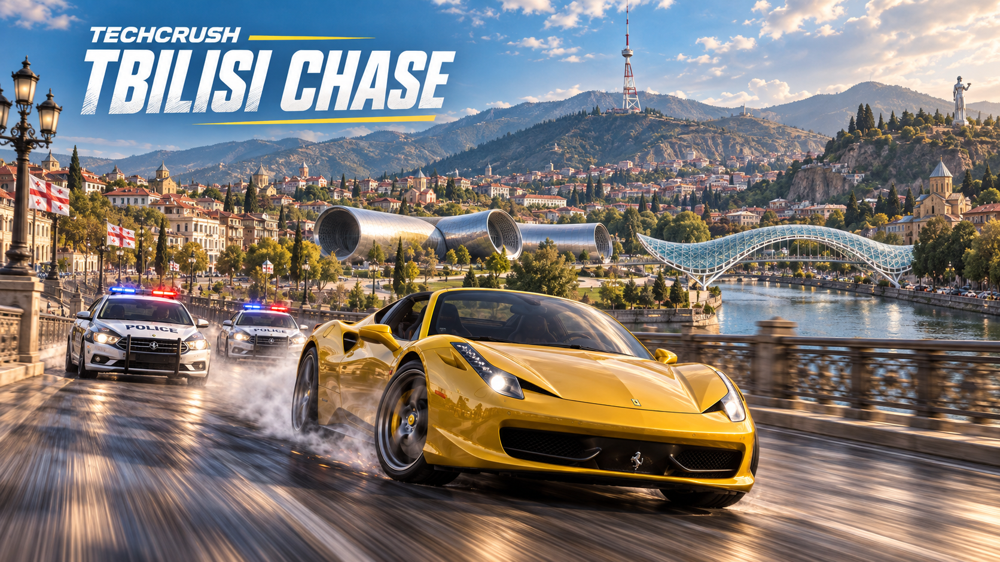

# TECHCRUSH — Georgian City Chase

## [▶ PLAY ONLINE — open to everyone](https://nightshift-chase-september.avtandilmghebrishvili.chatgpt.site/)

Play directly in your browser — no installation or sign-in required. Choose a driver name, race your community and climb the shared leaderboard. Each browser gets its own saved garage.

**Version 2.5 — a distinct fleet.** Keep the Original 458 and choose between a rounded coupe, wedge V12, luxury hypercar, rally hatch, long-hood GT, open speedster and the **TECHCRUSH Cyber electric pickup**. Cyber earns **2× driving coins and score**, with a balanced 5% stock speed advantage over Coast X. Aero upgrades replace the factory wing instead of stacking; wheel kits, cabin fittings and garage cameras match each model. Existing car ownership, paint, parts and progress are retained. [Fleet, rewards and upgrade guide](docs/FLEET.md).

**Version 2.4 — career milestone rewards.** Reach **level 10 in any city** to automatically unlock Falcon RS, Rioni GT and Coast X; reach **level 15** to unlock TECHCRUSH. Every fifth city level adds a **Mystery + Special** pair with bonus coins and six high-grade parts. Existing players receive retroactive rewards and retain every previously earned car. [Milestones, odds and save compatibility](docs/MILESTONES.md).

**Version 2.3 — tune your map.** Open **Setup → Map & Radar** to adjust minimap size (80–160%) and street zoom (0.5–2.5×), with a live preview and saved browser preferences. The full city map adds +/−, drag/pinch navigation, Fit City and Find Me. The radar starts 10% larger and respects small-screen control space. [Map controls](docs/INTERFACE.md#map-size-and-zoom-23).

**Version 2.2 — a compact workshop.** Switch between **Build & Paint**, **Upgrades** and **Boxes** instead of scrolling through a long garage. Keep the real 3D car, photo part picker, rarity inventory, exact before/after stats and every buy/equip/sell/fusion action. The launch menu and reward cards are smaller, and the hidden mobile studio stops rendering. Existing progress and gameplay rules stay intact. [Garage guide](docs/GARAGE.md).

**Version 2.1 — smash, earn, upgrade.** Every city has 48 two-sided TECHCRUSH banners. Three random banners per chase pay **4,000 coins each**; other player-broken decorations pay **25 coins**, up to 2,500 ordinary-decoration coins per run. Gold map pins mark the cash banners. The compact launch menu uses actual car-model photographs and a swipe/arrow car picker. Strong patrol hits cost up to 10 HP, tanks up to 15 HP, before armor. [Roadside rewards and menu guide](docs/ROADSIDE_REWARDS.md).

**Version 2.0 — three cities, one garage.** Tbilisi, Kutaisi and Batumi are all available from the start. Batumi adds the Black Sea waterfront, palms, Alphabet Tower, Ali & Nino, a Ferris wheel, landmark hotels and a distant airport. Streets follow adapted OpenStreetMap geometry; the environment is an original game interpretation, not a Google Maps scan. [Batumi and version 2.0 guide](docs/BATUMI.md).

**Earn four new cars.** The four original cars remain available. Reaching level 10 in any city automatically unlocks Falcon RS, Rioni GT and Coast X; level 15 unlocks the TECHCRUSH YouTuber. Every 10 banked takedowns still award a three-part creator box, whose exclusive parts can be saved until the car is unlocked. Platinum, Emerald, Ruby and TECHCRUSH are the four grades above Diamond; Emerald and above fit the signature car. [Reward rules](docs/MILESTONES.md).

**Classic handling returns.** Steering and drift sensitivity are adjustable in Setup; wheel presentation follows asphalt and kerb height. Auto lighting starts at night and completes a smooth **180-second** cycle. Original background music is enabled by default after the first user gesture, with mute, volume and reset controls. Menus and hidden tabs stop continuous game rendering; hidden/paused gameplay stops music and engine processing.

**Race your community.** Separate city progress, score, weekly and level-time leaderboards share server-saved results between players. Public result links include a generated graphic card with the city, car, name, time and score. Existing cars, credits, fusion upgrades, profiles and archived times are preserved. [Interface](docs/INTERFACE.md) · [Rankings](docs/COMMUNITY.md) · [Save/deployment guide](docs/DEPLOYMENT.md).

**[▶ WATCH / DOWNLOAD THE 46-SECOND GAMEPLAY TRAILER (1080p MP4)](https://github.com/AvtandilMghebrishvili/techcrush-tbilisi-chase/releases/download/v1.6.0/TECHCRUSH-Nightshift-Action-46s-1080p.mp4)**

Actual game footage: city flyovers, police chases, jumps, crashes, car selection, reward boxes, visible garage upgrades and cockpit driving. [Video guide and download instructions](docs/TRAILER.md).

[](https://github.com/AvtandilMghebrishvili/techcrush-tbilisi-chase/actions/workflows/ci.yml)

[Download complete source](https://github.com/AvtandilMghebrishvili/techcrush-tbilisi-chase/archive/refs/heads/main.zip) · [Releases](https://github.com/AvtandilMghebrishvili/techcrush-tbilisi-chase/releases)



_Illustrated key art. The browser game uses the 3D environment shown during play._

A single-player browser 3D chase through Tbilisi, Kutaisi and Batumi. Clear six checkpoints, dodge mixed traffic, ram patrols and break contact for eight seconds. Complete levels to earn credits and three-part reward boxes, then build a faster car in your saved garage.

## Play and save

Each browser receives a separate anonymous garage with **1,000 credits and one welcome box**. On your first start, choose a public driver name or Play as Guest. The trophy button opens Leaderboard / My Driver; you can rename your driver or hide your public row anytime. Progress is saved on the server without signing in. Share the game URL so friends start their own careers. Garage's **Back up private garage key** and **Restore garage** buttons transfer your progress to another device. Keep that backup private: it grants access to your garage.

People sharing one browser profile share its garage; use separate browser profiles for separate saves. A live chase is held in memory. Earned credits are banked when a level ends or you use the in-game Garage/Restart controls. Closing the tab mid-chase discards that unfinished run, while previously banked progress remains saved.

## Cars and controls

Choose the restored detailed **Original 458** or three additional unbadged models with different bodies, cabins and handling. The 458 uses the attributed licensed asset; Apex, Vector and Veyra are original procedural designs.

| Car          | Shape                                   | Stock top speed | Stock turbo ceiling |
| ------------ | --------------------------------------- | --------------: | ------------------: |
| Original 458 | Restored detailed roadster and interior |        230 km/h |            302 km/h |
| Apex R       | Rounded rear-engine coupe               |        209 km/h |            281 km/h |
| Vector V12   | Low angular V12 wedge                   |        241 km/h |            313 km/h |
| Veyra W16    | Wide grand-touring hypercar             |        270 km/h |            342 km/h |

Ceilings are on-road values; acceleration time, charge, turns and collisions affect actual speed. Installed parts increase these values.

| Control               | Action                                         |
| --------------------- | ---------------------------------------------- |
| W / Up                | Accelerate                                     |
| S / Down              | Brake, then reverse                            |
| A / D or Left / Right | Steer left / right                             |
| Space                 | Handbrake and drift                            |
| Shift                 | Turbo with exhaust flames and motion effects   |
| C                     | Chase, cockpit, hood, high chase cameras       |
| Q, held               | Rewind up to five seconds; release to continue |
| R                     | Recover on a clear road, with a score penalty  |
| P / Escape            | Pause or resume                                |
| M                     | Sound on/off                                   |
| Enter                 | Start from the garage                          |

Physical key codes support Georgian keyboard layouts. Mobile now defaults to **auto gas + thumb steering**: slide to turn, pull down to drift, and **tap NITRO once to burn the tank**. All three work together. Manual GAS, arrow buttons and **gyro / tilt steering** are available in **SETUP** (the sliders icon). [Mobile setup and performance guide](docs/MOBILE.md).

Portrait and landscape layouts include gas, brake/reverse, drift, turbo, rewind, recovery and camera switching. Auto accelerator can be switched off; braking overrides it. Auto graphics reduces rendering cost on touch devices, and Battery saver / High detail are selectable. A WebGL2 browser and internet connection are required.

## City lighting

The top **AUTO / NIGHT / DAY / DUSK** button cycles lighting modes. Auto starts at night, passes through dawn, daytime and dusk, and returns to night in **180 seconds of active simulation time**. Every level uses the same night start. The moon, occupied windows, street lamps and stronger player headlights appear after dark. Pause freezes the automatic cycle and rewind rolls it back with the chase. Your lighting choice is a local display preference; it does not alter your garage or difficulty.

The racing loading gauge follows asset preparation and shader warm-up. It adds no artificial wait. Lighting reuses existing assets, caps real street lights at three without additional shadows, and uses two instanced batches for nearby lamp glow. Garage previews keep their own studio lighting in every mode.

## Driving audio

Sound and original loop music default on after the first click, touch or key press. Press **M** or the top-right **SOUND** button to mute/unmute; Setup adjusts or resets music. All eight cars have distinct engine tuning, including V8, flat-six, V12 and W16-inspired profiles. Throttle changes the engine load; acceleration raises RPM, automatic shifts drop it, and boost adds intake air and a release sound. These are game-designed hybrid voices, not recordings of the named production cars.

Nearby traffic and patrols make a stereo pass-by whoosh based on relative speed and which side they pass. Wood cracks, metal impacts, stone debris, glass, heavy crashes and explosions follow actual contacts. Tires, drifting, wind, nearby sirens and the helicopter complete the mix; cockpit view softens exterior sound. Pause, rewind and mute silence the mix without replaying old collision sounds afterward.

## Career and garage

The garage now has an interactive **3D studio preview** of the selected car, free saved paint colors, tier-specific rims/tires/brakes/spoilers, and a detailed inspector with animated before/after comparisons. Preview any quality for free, then buy the next grade or install an owned part. The same exterior is used in the chase. [Garage guide and controls](docs/GARAGE.md).

Completing a level grants **one box**, a clear reward and the next level. Base rewards are **150 CR per checkpoint, 350 CR per player-caused patrol takedown, 120 CR per civilian wreck, 800 CR for escape and 1,800 + 250 × completed level CR for clearing the level**. Each is multiplied by **1 + 0.10 × (level − 1)**, rounded per award. Positive score awards use **1 + 0.15 × (level − 1)**. NPC-only crashes do not give free player rewards. The first clear each UTC day adds **500 CR**; every third consecutive clear adds **one extra box**. Eight one-time achievements award additional credits.

Each Street box draws exactly three independent parts. Duplicates count separately. Per-slot tier odds are **Bronze 55%, Silver 28%, Gold 13%, Diamond 4%**; all 14 part types are equally likely. There are no real-money purchases.

| Part               | Benefit                                |
| ------------------ | -------------------------------------- |
| Engine             | Top speed and acceleration             |
| ECU tune           | Acceleration                           |
| Turbocharger       | Boost power and speed                  |
| Nitro tank         | Longer boost duration                  |
| Intercooler        | Faster recharge, shorter cooldown      |
| Gearbox            | Acceleration and speed                 |
| Sport tires        | Grip and steering                      |
| Forged rims        | Acceleration and speed; visible wheels |
| Rear spoiler       | Handling and speed; visible wing       |
| Brake kit          | Stronger braking                       |
| Body reinforcement | Less collision damage                  |
| Suspension         | Softer landings and handling           |
| Race exhaust       | Boost power and speed                  |
| Carbon panels      | Acceleration and speed                 |

Install an owned better part free, or buy the next tier for **600 / 1,500 / 3,600 / 7,800 CR**. Replaced parts become spares. Sell them for **75 / 180 / 420 / 960 CR**. Equipment belongs to the selected car; money and loose parts are shared within its garage.

The garage shows photographic-style part artwork, colored rarity labels, category filters, current-car statistics and the exact benefit of the next paid tier or a free spare installation. Each car keeps its own equipment.

Each level changes checkpoint locations and visiting order across connected city roads. A circular radar preserves distant checkpoint bearings; the open center HUD shows distance along the road route. Thick, translucent TECHCRUSH arches mark each gate.

Each level increases police speed, acceleration, observation range and decision frequency. Waves arrive sooner and unit limits grow. **Level 2 adds larger SUVs and a helicopter; level 3 adds tracked blockade tanks and flanking.** SUVs have 145 HP; tanks have 220 HP, greater mass and slower steering. Active tanks are capped at two on levels 3–6 and three thereafter. The helicopter has rotating rotors and a searchlight, shares actual sightings, searches its last observed position, and can be evaded behind buildings or outrun. Escape requires losing both ground and air contact. Growth is bounded for playability.

## City and action

Rustaveli, Baratashvili, Rike/Europe Square and Abanotubani connect across the Mtkvari. Landmarks include Baratashvili and Metekhi bridges, an arcade driving adaptation of the pedestrian Peace Bridge, bath domes, Chreli Abano, Rike's twin tubes, Metekhi, Narikala, cable cars, mountains, the TV tower and Mother of Georgia. Continuous asphalt, markings, crossings, sidewalks, trees, furniture, Georgian flags and double-sided TECHCRUSH signs complete the streets.

Five more named streets, 33 additional road segments and instanced grass expand the city. Mountains and landmark hills block cars; road shoulders stay clear. Patrols use bridges to cross the river. Cars entering open water fall, splash and respawn on a clear road after sinking; player recovery costs 20 HP and supports rewind.

Shared footprints keep buildings off roads and make visible wings solid. High-speed collision substeps prevent thin-wall tunneling. Bridge railings remain solid during ordinary collisions; very hard normal hits (34 m/s, about 122 km/h) fracture only the struck panels. Openings remain at road junctions. Cars exchange impulses; hard impacts break trees, while poles, benches, bins, planters and street signs react immediately to contact. Decorative human figures have been removed; Mother of Georgia remains a landmark. Patrol HP takes several hits before explosion and replacement. Traffic includes original 1980s/1990s sedan, hatchback, wagon and van variants.

Hard contacts visibly crumple the struck front, rear, side or roof, with panel creases, scuffs and projected glass cracks. Headlights and exhaust mounts follow the same deformation; wheel and steering pivots remain fixed. Checkpoint repairs reduce body damage, and rewind restores it. Destroyed patrols and traffic leave solid, charred wrecks until replacement. Sparks, material fragments and a layered fire/smoke burst accompany the heavier impact and explosion sounds.

Four ramps launch cars into controllable rolls and pitch. A surviving overturned car automatically recovers upright after 0.8 seconds. Steering wheels turn around their own fixed shafts, exhaust effects remain attached to each model's outlets, and soft headlights replace flat road-light decals. Rewind restores position, HP, nitro, police, traffic, checkpoints, earned money and broken props together. Discarded future rewards cannot be banked again.

This is a reference-guided arcade reconstruction, **not a one-to-one scan**. Cached OpenStreetMap geometry is combined with documented manual connections and widened surfaces. User reference photos and Google Street View screenshots are not redistributed as textures. See [asset/map provenance](ASSETS.md).

## Run locally

Requires **Node.js 24+**:

```sh
git clone https://github.com/AvtandilMghebrishvili/techcrush-tbilisi-chase.git
cd techcrush-tbilisi-chase
npm start
```

Open **http://127.0.0.1:4173/**. Checked-in assets and Node's built-in SQLite allow local play without dependency installation. The server applies checked-in migrations and saves garages in the ignored `.sites-runtime/garages.sqlite`. Stop with Ctrl+C.

For development and production builds:

```sh
npm ci
npm test
npm run build
```

Authored browser modules remain in `dist/`. Build output goes into `dist/client/`, `dist/server/` and `dist/.openai/`. **Do not delete the whole dist folder.** The career edition requires its save API and database; static-only GitHub Pages cannot host the complete game.

## English documentation

| Guide                                      | Contents                                                |
| ------------------------------------------ | ------------------------------------------------------- |
| [Getting started](docs/GETTING_STARTED.md) | Local play, saves, troubleshooting                      |
| [Architecture](docs/ARCHITECTURE.md)       | Simulation, rendering, modules                          |
| [Career and API](docs/CAREER.md)           | Progression, storage, recovery, concurrency             |
| [Development](docs/DEVELOPMENT.md)         | Assets, roads, migrations, browser tools                |
| [Testing](docs/TESTING.md)                 | Unit checks, route controller, browser review           |
| [Deployment](docs/DEPLOYMENT.md)           | Access, Sites, Worker/D1 self-hosting                   |
| [Gameplay trailer](docs/TRAILER.md)        | Watch, download and share the 46-second video           |
| [Mobile driving](docs/MOBILE.md)           | Touch, gyro, calibration, fullscreen and phone graphics |
| [Validation](VALIDATION.md)                | Observed results and limitations                        |
| [Changelog](CHANGELOG.md)                  | Release changes                                         |
| [Assets](ASSETS.md)                        | Attributions and licenses                               |

The public repository includes code, runtime assets, preparation scripts, map source data, tests, schema/migrations and the dependency lockfile. It excludes player saves, private keys, caches and personal reference photos. Public source access does not grant write access.

Project code is MIT. Third-party assets, OSM data, generated textures and TECHCRUSH branding retain their respective terms. See [LICENSE](LICENSE), [ASSETS.md](ASSETS.md) and the in-game Credits page.
