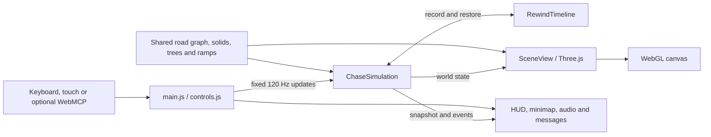

# Architecture

The game is native JavaScript ES modules, HTML and CSS, rendered with Three.js 0.180.0. Simulation modules run without a DOM, which allows physics and pursuit tests to execute directly in Node. `dist/` is authored source, not disposable build output.

## Runtime flow



`main.js` accumulates animation-frame time and calls `sim.update(1 / 120, input)` at a fixed rate. Incoming frame time is capped at 0.05 seconds to limit catch-up after interruptions. Rendering occurs once per animation frame; HUD/audio updates are throttled to roughly 0.08 seconds. The simulation owns positions, velocities, damage, scoring and pursuit decisions. The renderer reads that state and maintains transient visual effects.

## Module guide

All paths below are relative to `dist/`.

| Module                                                    | Responsibility                                                                                                |
| --------------------------------------------------------- | ------------------------------------------------------------------------------------------------------------- |
| `main.js`, `index.html`, `style.css`                      | Garage, controls, loop, pause/end screens, HUD, minimap, synthesized audio and optional browser tools         |
| `controls.js`, `config.js`                                | Physical keyboard normalization, input values, car trims and camera identifiers                               |
| `simulation.js`                                           | Player integration, traffic, police AI, damage, reinforcement waves, checkpoints, recovery and end conditions |
| `contacts.js`                                             | Oriented vehicle contact detection, separation and mass-weighted impulses                                     |
| `city-map.js`                                             | Road graph, nearest-road projection, routing, checkpoints and building collision footprints                   |
| `road-data.js`                                            | Generated nodes/edges from archived OSM and manual connections                                                |
| `road-surface.js`, `road-surface-data.js`                 | Continuous asphalt, sidewalk and curb geometry                                                                |
| `district-data.js`                                        | Landmark anchors, reserved sites, river and district collision data                                           |
| `world-props.js`, `trees.js`                              | Shared tree placement and solid trunks; model loading, detail levels, wind and falling trees                  |
| `stunts.js`                                               | Shared ramp placement, launch, airborne rotation, landing and rollover state                                  |
| `rewind.js`                                               | Five-second snapshot buffer, reverse interpolation and branching history                                      |
| `view.js`, `camera-clearance.js`                          | Scene, lighting, model synchronization, follow/cockpit/hood/aerial cameras and wall clearance                 |
| `sports-car.js`, `cockpit.js`, `patrol-car.js`            | Sports-car asset setup, cabin, procedural patrol and civilian variants                                        |
| `realistic-city.js`, `scenery.js`                         | Street appearance, buildings, mountains and environment                                                       |
| `landmarks.js`, `kartlis-deda.js`, `tbilisi-districts.js` | Georgian flags, monuments, expanded districts and TECHCRUSH signs                                             |
| `route-guide.js`, `effects.js`, `turbo-effects.js`        | Route arrows, health/explosions, boost flames, tire smoke and skid effects                                    |

## Coordinates and input

Distances use approximate metres, time uses seconds and speeds use metres per second. The HUD multiplies speed by 3.6 for km/h. The local map projection is:

```js
x = -(longitude - 44.799) * 83140;
z = (latitude - 41.699) * 111320;
```

Y points upward. North is positive Z and east is negative X. Route headings use `Math.atan2(dx, dz)`. Because of this coordinate convention, do not infer control signs from a conventional east-positive map: normalized steering **-1 means left and +1 means right** from the player's view. Physical `KeyboardEvent.code` handling preserves WASD on Georgian keyboard layouts. Reverse movement changes the turning response naturally.

The simulation input is `{ throttle, steer, brake, boost, rewind }`: throttle/steer range from -1 to 1, and the remaining values are booleans. `brake` is the handbrake; negative throttle provides normal braking/reverse. Recovery is a separate `sim.recover()` action.

## World and navigation

The current road graph has 519 nodes and 671 segments in one connected component. The same graph drives NPC routes, checkpoint guidance, minimap lines and recovery positions. The generated road surface joins widened streets into one asphalt polygon containing 46 block islands. Map changes must regenerate both graph and surface.

District data is shared by collision and drawing code. Buildings use rotated rectangular footprints. Car contacts use oriented boxes and multiple separation passes, including NPC-to-NPC collisions. Tree models share their trunk locations with the simulation; poles, benches, bins, planters and signs share breakable collision bodies. Ramps share one definition between drawing and flight physics. Bridges use the road datum rather than a multi-level road system.

Police combine graph navigation with local steering. Pursuers follow observations, interceptors target an estimated future position, and blockade units stage across a road ahead. Officers share visible sightings rather than continuously reading an unseen player's current position. Stuck detection, reverse recovery, corner braking and local vehicle avoidance work alongside contact physics. Reinforcement and replacement timers are separate so destroying a car and surviving another wave have distinct effects.

## Run state and rewind

Phases are `ready`, `running`, `paused`, `rewinding`, `won`, `wrecked` and `busted`. Starting a run resets the world. Losing focus releases held input and pauses. A completed escape ends the run; wrecked or captured runs can still rewind if history remains.

`RewindTimeline` records at 30 Hz and retains up to five seconds. Snapshots contain player, police, traffic, radio observations, explosions, broken-tree state, and scalar score/checkpoint/chase timers. Reverse playback restores a full frame, then interpolates visible motion. It does not interpolate between different patrol identities across respawn. Releasing selects the earlier authoritative frame and discards its former future.

Camera smoothing and short-lived smoke/skid rendering are presentation state, not part of an exact historical camera recording. Transient trails reset when rewinding. New mutable gameplay fields must be included in the rewind snapshot, or time reversal could leave damage, rewards or timers in the future.

## Rendering and performance

The renderer uses a local HDR sky/environment, textured terrain, moving sun-shadow coverage, instanced static objects, and geometry merged by material and spatial tile. Trees switch between 123,246-triangle and 20,943-triangle models and are hidden beyond 420 metres. Distant detailed cars are culled. GLB models are prepared without runtime Draco decoding workers. Physics rejects distant lots before more expensive contact/visibility calculations.

This is an arcade reconstruction informed by references, with approximated roads/buildings and original landmark geometry. It is not photogrammetry or a one-to-one survey. See [asset provenance](../ASSETS.md) and [measured validation](../VALIDATION.md).

## Storage and external services

Active run state lives in memory. Career profiles persist through `profile-client.js` → `server/api.mjs` → D1 (`DB`), with a local SQLite adapter for development. `garage-ui.js` and `garage.css` provide inventory, purchases and reward animations. `progression.js` supplies shared rules. See [Career and API](CAREER.md) for identity, recovery, concurrency and limitations.

`server/worker.mjs` handles `/api/*` and delegates other requests to `ASSETS`. `scripts/build-server.mjs` bundles the Worker and copies browser modules into `dist/client`. `db/schema.ts` and `drizzle/` define the database. Generated subdirectories are ignored; authored files in `dist/` remain tracked.

`car-models.js` supplies three procedural bodies with surface-fitted details and equipment visuals. `sports-car.js` loads the independently selectable Original 458 and environment lighting. `vehicle-details.js` binds each steering rotor's rest quaternion and local shaft axis (local Y for the 458 asset; local Z for procedural cabins), and creates soft spotlights. Exhaust anchor positions belong to each model, so animated flames stay at the outlets.

`map-clearance.js` uses full oriented-footprint overlap tests to relocate landmarks and reject lots across roads. The clock-building wing shares corrected render/collision coordinates. `bridge-data.js` shares unbreakable rail segments with rendering and physics and leaves road-width junction openings. `breakable-props.js` links visible lamps, flags, signs, benches, bins and planters to simulation/rewind state; linked contacts let one bench use several trunk-style colliders. A broken prop receives an immediate visible rotation in the contact frame. High-speed player movement resolves obstacles in substeps no longer than 0.8 metres.

Profile schema 2 adds the `classic` equipment slot. Server reads migrate older profile JSON without resetting credits, level, inventory, selected car or equipment. The next successful write persists the migrated JSON; no SQL table migration is needed.

There is no multiplayer or persistent leaderboard. Runtime assets are local to the deployment; optional Google Fonts have fallbacks. Asset preparation may contact providers but gameplay needs no provider API key. Optional WebMCP controls expose ordinary input actions only when supported by the browser.

[Back to README](../README.md)

## Level routes and mixed pursuit (1.2)

`level-routes.js` deterministically chooses six road-center gates from clear segments near the established districts. Position and order depend on level; the original route remains level 1. Each run owns `sim.checkpoints`, used by scoring, recovery, the road guide, center distance and radar. `hud-math.js` sums route legs and clamps distant radar markers radially. `checkpoint-arch.js` fits each branded arch to its road width.

`air-support.js` owns the helicopter state. A segment/box intersection checks line of sight in three dimensions against rotated building footprints, including thin walls. Roof clearance controls altitude. Ground radio and aircraft sightings use the same last-seen observation contract; neither keeps reading a player after contact is lost. The rewind frame includes helicopter position, rotor phase, observation and tracking state.

`makePolice` assigns sedan/SUV/tank stats. Active tank counts are bounded and reset correctly on restart. `pursuit-vehicles.js` renders the mixed fleet and aircraft; `view.js` replaces meshes when a respawn changes vehicle kind. Larger units use larger static clearance and mass-aware dynamic contacts.

`garage-presentation.js` calculates displayed benefits through the same `upgradedSpec` used by driving physics. Paid next-tier and free-spare previews are distinct. A single part atlas feeds all cards and reward slots. `garage-refresh.css` and `ui-refresh.css` provide responsive presentation without changing server storage or reward probabilities.
